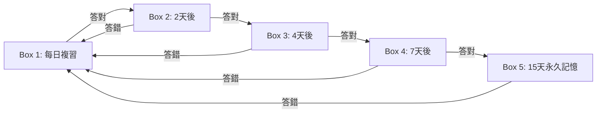

# 🎮 互動式記憶字卡 Pro 遊戲開發與通用架構藍圖 (Game Creation Blueprint)

> **版本**：v3.0 (2026-09 最新無伺服器架構升級版)  
> **適用對象**：想要製作任何學科（英語單字、日語五十音、國中會考、高中學測、餐飲觀光、護理醫學、歷史地理、資訊程式術語等）互動字卡與闖關測驗遊戲的教師、開發者與 AI 編程助手。  
> **核心哲學**：**100% 零伺服器成本、免帳密阻礙、極速流暢、手機平板通用、一鍵 GitHub Pages 部署**。

---

## 📋 目錄
1. 🎯 **核心技術選型與零成本架構 (Tech Stack)**
2. 📚 **通用題庫資料結構規範 (Universal Data Schema)**
3. 🎮 **三大經典學習模式設計 (Core Gameplay Mechanics)**
4. 🧠 **萊特納間隔重複記憶系統 (Leitner SRS)**
5. 👥 **座號登入與訪客雙軌機制 (Zero-Password Identity)**
6. 📊 **Google 試算表免伺服器成績收集 (Google Sheets + GAS)**
7. 🔊 **純網頁跨平台語音與音效引擎 (Web Speech + Web Audio)**
8. 🚀 **全新學科遊戲製作 SOP (5 步驟極速複製法)**

---

## 1. 🎯 核心技術選型與零成本架構 (Tech Stack)

教育現場最常遇到的痛點是：**缺乏伺服器維護預算、學生容易忘記帳號密碼、學校網路環境複雜**。本系統架構完全針對此設計：

| 模組 | 選用技術 | 優勢與考量 |
| :--- | :--- | :--- |
| **前端核心** | **React 19 + TypeScript + Vite 6** | 最新一代極速建置、型別安全、組件化架構 |
| **樣式系統** | **Tailwind CSS + Lucide React** | 響應式排版，手機、平板、電子白板完美適應 |
| **資料持久化** | **瀏覽器 LocalStorage** | 本機隔離快取，免資料庫月租費、離線可用 |
| **成績統整** | **Google Apps Script (GAS) + 試算表** | 0 元雲端成績單，自動生成全班總表與歷程 |
| **語音引擎** | **Web Speech Synthesis API** | 瀏覽器原生朗讀，支援英、日、法、西等多國語言 |
| **音效合成** | **Web Audio API** | 純演算法合成正弦波音效，零外載音檔延遲 |
| **雲端託管** | **GitHub Pages + GitHub Actions** | 免費 CDN 全球加速，Git Push 自動完成部署 |

---

## 2. 📚 通用題庫資料結構規範 (Universal Data Schema)

所有關卡題庫抽離於獨立檔案（例如 `src/data/grade3Words.ts` 或 `src/data/mySubjectWords.ts`），符合標準介面：

```typescript
export interface WordItem {
  id: string;                // 唯一代碼 (如 "u1-01", "jp_n5_001")
  levelId: number;           // 關卡編號 (1 ~ 8)
  word: string;              // 題目 / 外語單字 / 核心專有名詞
  phonetic?: string;         // 音標 / 讀音 / 假名讀音 (選填)
  translation: string;       // 中文釋義 / 題目正確答案
  partOfSpeech?: string;     // 詞性 (如 "n.", "v.", "adj.") (選填)
  exampleEn?: string;        // 英文例句 / 術語情境說明 (選填)
  exampleZh?: string;        // 例句中文翻譯 (選填)
  category: string;          // 單元或小節分類名稱 (如 "生活英語", "外場服務")
  sectionCode?: string;      // 小節代碼 (如 "1-1", "3-2") (選填)
  hint?: string;             // 課本出處或記憶口訣 (選填)
  page?: number;             // 課本頁碼 (選填)
}
```

### 多學科套用範例：
- **英語學科**：`word` = "hospitality", `translation` = "餐旅款待精神", `phonetic` = "[ˌhɑːspɪˈtæləti]"
- **日語學科**：`word` = "ありがとう", `translation` = "謝謝", `phonetic` = "arigatou"
- **醫護學科**：`word` = "Hypertension", `translation` = "高血壓", `category` = "心血管系統"
- **資訊學科**：`word` = "Recursion", `translation` = "遞迴", `category` = "演算法基礎"

---

## 3. 🎮 三大經典學習模式設計 (Core Gameplay Mechanics)

經過大量教學實測，以下三大模式能產生最高的專注度與記憶維持率：

### 模式 1：🎴 3D 雙面翻卡朗讀 (Flashcards) + 斷點續刷 (Resume)
- **正面**：顯示核心字詞、發音鍵、音標。
- **反面**：顯示釋義、詞性、例句、出處。
- **評定反饋**：提供「熟記 (Easy)」、「模糊 (Good)」、「忘記 (Again)」三種回饋，連動萊特納記憶盒。
- **斷點續刷 (Resume)**：自動記錄當前卡片索引。關閉網頁或中途跳出，再次進入可選擇一鍵續刷或從頭複習。

### 模式 2：🎧 聽力選字測驗 (Listening Quiz)
- 原生 TTS 自動發音，題目不顯示文字（僅聽聲音）。
- 學生從 4 個中文選項或英文選項中選出正確答案。
- 支援連續答對加分（Streak Bonus）與倒數計時。

### 模式 3：🧩 雙語連連看 (Matching Game) + Fast-Tap 極速反應
- 左右或隨機排列中英文方塊進行連線配對。
- **關鍵體驗優化**：
  - 錯誤反饋延遲控制在 **350ms** 以內，避免學生乾等。
  - 支援 **Fast-Tap 搶先點擊**：在 350ms 錯誤提示期內若玩家點擊新卡片，前次卡片立即翻回，新卡片立即開啟，確保手速無阻礙。

---

## 4. 🧠 萊特納間隔重複記憶系統 (Leitner SRS)

將艾賓浩斯遺忘曲線落實於程式邏輯：



- 每天登入自動統計今日待複習（Due）單字數。
- 提供「📖 錯題本」介面，讓學生隨時針對 Box 1 的弱點單字進行個別突擊！

---

## 5. 👥 座號登入與訪客雙軌機制 (Zero-Password Identity)

- **學生端（01 ~ 35 號）**：
  - 點擊號碼直接進入個人化學習空間。
  - 進度、星星與天數存於本機 LocalStorage（以 `flashcard_pro_g3_${seatNumber}` 為命名空間隔離）。
- **訪客端（Guest Mode）**：
  - 免座號直接暢玩全關卡，供外賓、評審或未編號學生試用。
  - 訪客成績不寫入班級排行榜，保障正式榜單公平。

---

## 6. 📊 Google 試算表免伺服器成績收集 (Google Sheets + GAS)

教師後台只要設定一組 Google Apps Script Web App 網址：
1. 學生每完成測驗或更新星星，前端透過 `fetch(gasUrl, { method: 'POST', mode: 'no-cors', body: ... })` 非同步發送。
2. Google 試算表自動生成兩大分頁：
   - **全班成績總表**：座號、總星星、熟練度、各關卡進度與最後上線時間。
   - **作答流水帳**：精確記錄每筆測驗的時間戳、單元小節與答對率。

---

## 7. 🔊 純網頁跨平台語音與音效引擎 (Web Speech + Web Audio)

- **Web Speech Synthesis API**：
  - 透過 `window.speechSynthesis` 執行文字轉語音。
  - 支援 0.8x 慢速（初學者）與 1.0x 正常速度切換。
  - 支援美式英語 (`en-US`)、日語 (`ja-JP`) 等多語言代碼切換。
- **Web Audio API 原生音效合成**：
  - 透過 `AudioContext` 產生正弦波與方波，模擬答對（高音雙音階）、答錯（低沉滑音）、升級音效。
  - 零外部 `.mp3` 檔案，確保在 iOS Safari 與校園低速網路環境中 100% 穩定發聲。

---

## 8. 🚀 全新學科遊戲製作 SOP (5 步驟極速複製法)

未來若需為新科目（如日文、國中生物、高中歷史）製作新遊戲：

1. **Clone 專案**：
   ```bash
   git clone https://github.com/Abel54575457/flashcard-pro-grade3.git my-new-game
   cd my-new-game
   npm install
   ```
2. **替換題庫**：
   編輯 `src/data/grade3Words.ts`，填入您的新學科資料。
3. **客製化外觀與班級**：
   在 `src/components/LoginModal.tsx` 與 `src/components/Leaderboard.tsx` 修改班級名稱與座號人數。
4. **驗證建置**：
   ```bash
   npm run build
   ```
5. **發布上線**：
   推送到個人的 GitHub 倉庫，GitHub Actions 將在 1 分鐘內自動發布至 GitHub Pages！

---
*本藍圖為標準教育遊戲開發規範，各學科老師與 AI Agent 皆可遵照此藍圖自由擴充與發布。*
